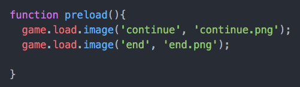
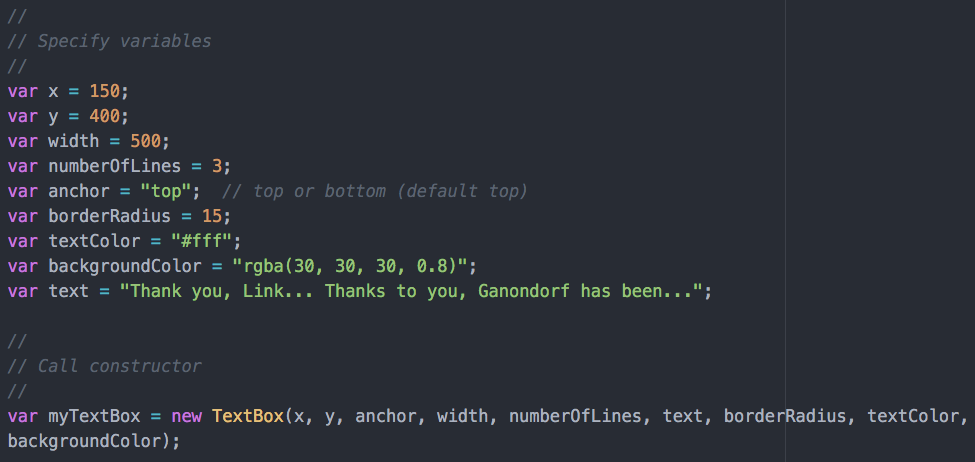
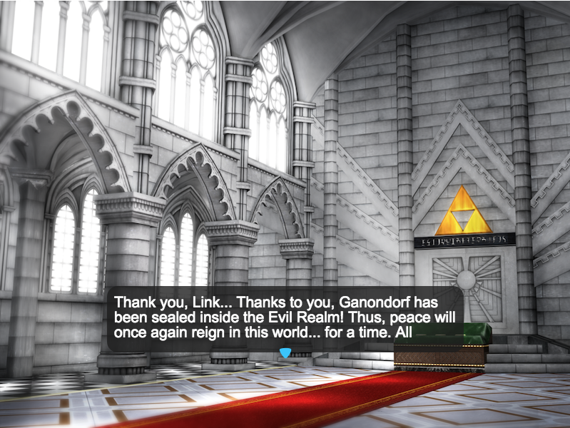

# text-bubbles-for-phaser

A text bubble class for phaser.

# how to use

1. Place script tag in document header ```<script src="TextBox.js"></script>```

2. Load two images in preload phaser function



3. Set the xy coords, width, and line height. The chosen y coord will either be the top or bottom left corner of the text bubble depending on what ```anchor``` is set to (either "top" or "bottom"). Text color and background color can be set. Lastly, set ```text``` to the display text.



4. Note, the text bubble will automatically display text in segments of ```numberOfLines``` until the text ends at which time the text bubble disappears.   

5. Call ```myTextBox.showNext()``` method to prompt the text box to show the next lines of text.

# live demo

View the [live demo](https://strawstack.github.com/text-bubbles-for-phaser)

# screenshot


