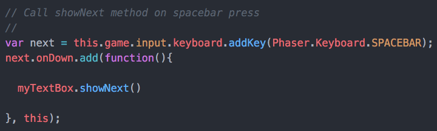

# text-bubbles-for-phaser

A text bubble class for phaser. View the [live demo](https://strawstack.github.com/text-bubbles-for-phaser) (Note, press spacebar to advance the text in the demo)

# screenshot

[](https://strawstack.github.com/text-bubbles-for-phaser)

# how to use

- Place script tag in document header ```<script src="TextBox.js"></script>```

- Load two images in preload phaser function


- Set the ```x``` ```y```, ```width```, and ```numberOfLines```. (The chosen y coord will either be the top or bottom left corner of the text bubble depending on if ```anchor``` is set to "top" or "bottom". Set ```textColor``` and ```backgroundColor```. Set ```text``` to the desired text, and create an instance by calling the constructor as shown in the image.


- Note, the text bubble will automatically display text in segments of ```numberOfLines``` until the text ends at which time the text bubble disappears.   

- Call ```myTextBox.showNext()``` method to prompt the text box to show the next lines of text. As per below, the demo calls this method when the spacebar is pressed.


